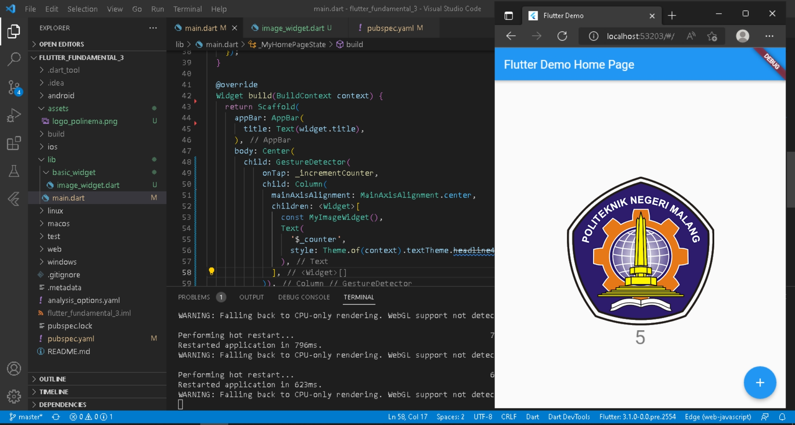
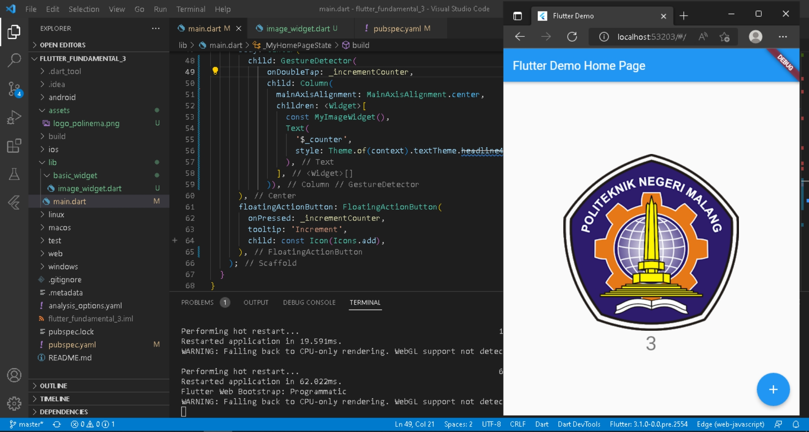
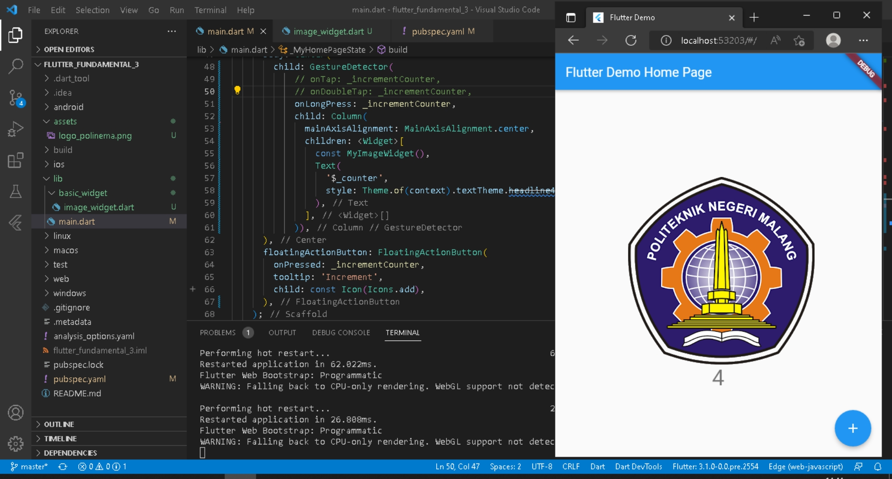

# flutter_fundamental_3

SILVIA NUR MAHMUDAH

## Praktikum 1
onTap

fungsi onTap : listener ketika user mengetuk widget

onDoubleTap

fungsi onDoubleTap : listener ketika user mengetuk 2x

onLongPress

fungsi onLongPress : listener ketika user menekan dan tahan beberapa detik

## Praktikum 2

input yang diketikkan akan tampil dan terdapat validasi bahwa inputan tidak boleh kosong

## Praktikum 3

inputan hanya diisi dengan angka tidak dengan huruf atau simbol